  

  <!-- Snake Code Contribution Map 贪吃蛇代码贡献图 -->

#  🙋 Hello World

<table>
<tr>
  <td>

<!-- About me 关于我 -->
### 🤺 About Me

&emsp;&emsp;大家好，我是江小生。

&emsp;&emsp;热爱读书、旅行、骑行。

&emsp;&emsp;热爱计算机科学和生命科学事业。

&emsp;&emsp;我们正在让这个世界变得更加美好，通过代码的重复使用和延展构建完美体系。

  <strong>&emsp;&emsp;We're making the world a better place. Through constructing elegant hierarchies for maximum code reuse and extensibility.</strong>

    </td>
</tr>
</table>
 

<!-- wakatime 统计 -->
### 📊 WakaTime

<picture>
  <source
    srcset="https://github-readme-stats.vercel.app/api/wakatime?username=onecany&layout=compact&text_color=f0f6fc&bg_color=00000000&hide_border=true&hide_title=true"
    media="(prefers-color-scheme: dark)"
  />
  <source
    srcset="https://github-readme-stats.vercel.app/api/wakatime?username=onecany&layout=compact&text_color=1f2328&bg_color=00000000&hide_border=true&hide_title=true"
    media="(prefers-color-scheme: light), (prefers-color-scheme: no-preference)"
  />
  
</picture>

 

<!-- just img 图片 -->

<!--  skill badge 技能徽章 -->

```mermaid
mindmap
  root((江小生))
    编程
      Web开发
      网络爬虫
      人工智能
    摄影
      人文
      建筑
      风景
    旅行
      苏州
      杭州
      深圳
      贵阳
      宁波
    阅读
      人物传记
      个人成长
      社会文化
      心理
      计算机技术
```

💪 正在学习

  
 

🧠🧰 常用的工具

<!-- programming tool icon 编程工具图标 -->
 

<!-- svg -->

 

 

<!-- all lang in one  icon-->

[(https://github.com/onecany)

<!-- 代码贡献 -->

    

    

